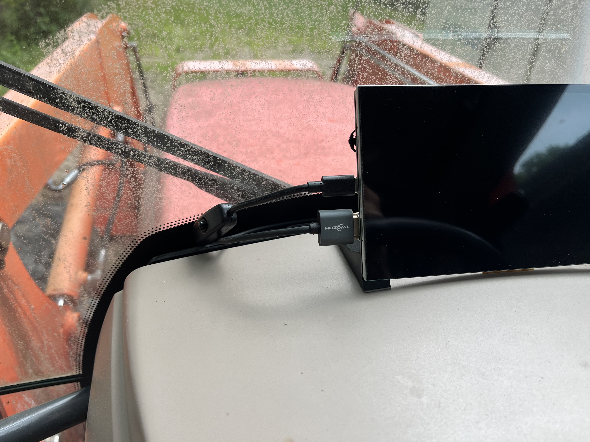
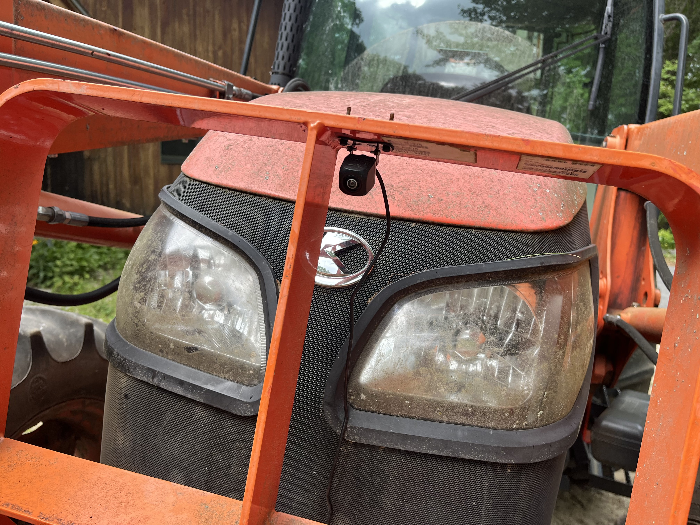

# Tractor Camera & Display System

Front-mounted camera and video display for a tractor

---

## Table of Contents
1. [Overview](#overview)
2. [Components](#components)
3. [Wiring](#wiring)
4. [Physical Setup](#hardware-setup)
5. [Photos](#photos)

---

## Overview
A small camera mounted on the front of a farm tractor with an interior screen showing the live feed.

**Purpose:**
- Helps my grandfather see the forks and other attachments for more accurate plowing and scooping

---

## Components
| Part                | Use                    |
| ------------------- | ---------------------- |
| 12 V vehicle camera | Captures video         |
| 12-5 V step-down    | Steps 12 V down to 5 V |
| 5 V USB hub         | Splits 5 V power       |
| RCA-HDMI adapter    | Converts RCA to HDMI   |
| 7" IPS monitor      | Displays the feed      |

---

## Wiring
- **12 V ->** Camera VCC and step-down  
- **GND ->** Camera GND and step-down GND (common ground)  
- **5 V ->** USB hub VCC (from step-down)  
- **USB hub ->** powers RCA-HDMI adapter and 7" monitor  
- **Camera RCA ->** Adapter RCA input  
- **Adapter HDMI ->** Monitor HDMI input  

---

## Hardware Setup
1. **Mount camera**  
   - Location: front frame  
   - Hardware: zip ties, silicone, crimp connectors
2. **Run wires**  
   - Route along chassis  
   - Secure with zip ties
3. **Install display**  
   - Dashboard mounted
4. **Power connections**  
   - Inline fuse holder for USB hub  
   - Tapped into the tractor’s 12 V accessory/aux circuit (only active in accessory mode)

---

## Power Notes
- Estimated load: camera (~0.2 A @ 12 V), HDMI converter and 7" monitor (~1.0–1.5 A @ 5 V via the buck)

---

## Photos
-  - Kubota Tractor - M4 Series
    
-  - Dash before removal
    
-  - Dash after removal
    
-  - Soft mount of camera above bucket
    
-  - Finding a good ground using the battery and testing bare metal
    
-  - Found a good ground on this bolt
    
-  - Spreading out cable to supply power to the camera and RCA video to the cab
    
-  - Used splice connector to connect camera to extension power wire
    
-  - Temporary holding spot for wire while routing
    
-  - Followed sleeve to the back of the engine bay
    
-  - Routed cable under the cab and up through the floor mat
    
-  - Routed cable up through dash
    
-  - Tractor has auxiliary fuse for feature expansion
    
-  - Crimped camera power and USB hub power to tractor 12 V auxiliary 
    
-  - Powered RCA to HDMI converter with USB hub and have open USB for interior screen 
    
-  - Plugged HDMI and screen power into hub and tested power, screen successfully displayed camera output
    
-  - Routed HDMI and USB C power cable to top of dashboard
    
-  - Mounted screen using double sided foam tape for vibration dampening
    
-  - Installed a button USB adapter for distraction control
    
-  - Hard mounted camera
    
